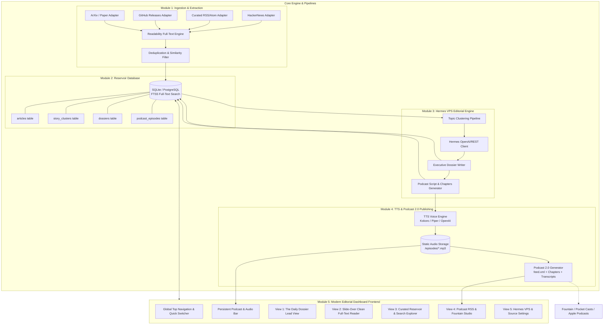

# News Dashboard & Hermes Editorial Aggregator: System Architecture & Layout Blueprint

---

## 1. Modular System Architecture (Decoupled & Extensible)



---

## 2. Decoupled Module Breakdown

### Module 1: Ingestion & Extraction Layer (`/packages/ingest`)
* **Pluggable Source Adapters (`BaseAdapter`)**:
  * `HackerNewsAdapter`: Pulls top/best stories with high score thresholds and comment sentiment.
  * `RssAdapter`: Auto-fetches curated engineering and tech publication feeds.
  * `GitHubTrendingAdapter`: Ingests breakout repositories and major release notes.
  * `PaperAdapter`: Scrapes selected arXiv categories (e.g. `cs.AI`, `cs.DC`).
* **Content Sanitizer & Full-Text Extractor**:
  * Uses Mozilla Readability to strip sidebars, cookie banners, navigation, and ads.
  * Produces standardized clean Markdown with preserved code blocks and high-res images.
* **Deduplication Engine**:
  * Computes URL canonicalization and title/snippet similarity to merge redundant coverage.

### Module 2: Reservoir Database Layer (`/packages/db`)
* **SQLite with FTS5** (or Postgres) for zero-latency queries and full-text keyword indexing.
* **Core Schemas**:
  1. `articles`: id, source_id, title, url, author, publisher, published_at, clean_content, reading_time, signal_score, tags.
  2. `story_clusters`: id, dossier_id, headline, narrative_summary, key_takeaways (JSON), source_article_ids (JSON), category.
  3. `dossiers`: id, edition_type (`morning` | `evening` | `custom`), title, executive_tldr, created_at, is_published.
  4. `podcast_episodes`: id, dossier_id, title, audio_url, duration_seconds, chapters (JSON), transcript (text), published_at.

### Module 3: Hermes VPS Editorial Engine (`/packages/hermes`)
* **Modular LLM Client**:
  * Configurable base URL (`http://vps-ip:port/v1` or reverse proxy HTTPS domain), API key, and model name.
* **Structured Generation Pipelines**:
  1. *Clustering Prompt*: Groups the day's 50+ raw articles into 4–6 thematic storylines.
  2. *Editorial Synthesis Prompt*: Writes structured markdown reports with narrative synthesis, bullet takeaways, and critical analysis.
  3. *Podcast Script Prompt*: Converts the written dossier into a natural, engaging spoken script with chapter markers and timestamps.
  4. *In-Reader Q&A*: Handles contextual margin questions (*"Explain this technical term"*, *"Compare to alternative solutions"*).

### Module 4: TTS & Podcast 2.0 Engine (`/packages/podcast`)
* **TTS Adapter (`BaseTTSProvider`)**:
  * Pluggable backend: Kokoro-82M, Piper TTS, or OpenAI-compatible `/v1/audio/speech`.
* **Podcast 2.0 XML Engine (`/feed.xml`)**:
  * Implements `<podcast:chapters url=".../chapters.json" type="application/json" />`.
  * Implements `<podcast:transcript url=".../transcript.txt" type="text/plain" />`.
  * Standard iTunes & RSS tags (`<enclosure>`, `<itunes:summary>`, `<itunes:duration>`, `<pubDate>`).

---

## 3. UI/UX Layout & Wireframe Blueprint

### 1. Global Frame & Navigation

```
+---------------------------------------------------------------------------------------------------+
|  [LOGO] HERMES CHRONICLE       [Daily Dossier]  [Reservoir]  [Podcast Studio]  [Settings]   (Cmd+K) |
|  Edition: Morning — Aug 14, 2026                                              [⚡ Sync] [Theme 🌗] |
+---------------------------------------------------------------------------------------------------+
|  [🎧 PLAY EPISODE: Daily Tech Intelligence #42 (4m 18s)]  [⏮ 15s] [▶] [⏭ 15s]  [1.25x] [Chapters ▼] |
+---------------------------------------------------------------------------------------------------+
```

---

### 2. View 1: The Daily Dossier (Lead View)

```
+---------------------------------------------------------------------------------------------------+
|  ═══════════════════════════════ THE MORNING INTELLIGENCE DOSSIER ═══════════════════════════════  |
|                                                                                                   |
|  ┌─ EXECUTIVE 60-SECOND BRIEFING ───────────────────────────────────────────────────────────────┐  |
|  │ • Major Linux kernel fix deployed mitigating speculative execution latency overhead.        │  |
|  │ • New state-of-the-art open weights model released with 128k native reasoning context.       │  |
|  │ • Browser engines unify WebGPU standard shaders for mobile accelerators.                     │  |
|  └──────────────────────────────────────────────────────────────────────────────────────────────┘  |
|                                                                                                   |
|  ┌─ STORY CAPSULE 1: SYSTEMS & INFRASTRUCTURE ──────────────────────────────────────────────────┐  |
|  │ 🏷️ High Signal  •  ⏱️ 4 min read  •  🔗 3 Sources                                             │  |
|  │ ### The Next Era of Kernel Isolation and Ephemeral MicroVMs                                    │  |
|  │                                                                                               │  |
|  │ [Editorial Narrative]                                                                         │  |
|  │ Modern cloud virtualization is shifting rapidly towards sub-millisecond cold starts...        │  |
|  │                                                                                               │  |
|  │ 📌 Key Developments:                                                                          │  |
|  │   - AWS and Cloudflare publish benchmarks on isolated vCPU scheduling.                        │  |
|  │   - Memory footprint dropped by 64% in new benchmark runs.                                    │  |
|  │                                                                                               │  |
|  │ 📰 Sources: [Cloudflare Blog ↗]  [Hacker News Discussion (312 pts) ↗]  [Ars Technica ↗]       │  |
|  │                                                                                               │  |
|  │ [📖 Read Full Coverage]    [💬 Ask Hermes About This]    [🎧 Listen to Section]               │  |
|  └──────────────────────────────────────────────────────────────────────────────────────────────┘  |
|                                                                                                   |
|  ┌─ STORY CAPSULE 2: AI & LLM ARCHITECTURE ─────────────────────────────────────────────────────┐  |
|  │ ...                                                                                           │  |
+---------------------------------------------------------------------------------------------------+
```

---

### 3. View 2: Slide-Over Full-Text Reader (Zero Distractions)

```
+-----------------------------------------------------------------+---------------------------------+
| [Main Dashboard blurred / dimmed in background]                | ✕ Close Drawer   [Aa] [🎧 Read] |
|                                                                 |---------------------------------|
|                                                                 | CLOUDFLARE BLOG  •  AUG 14 2026 |
|                                                                 |                                 |
|                                                                 | ## How We Reduced MicroVM Cold  |
|                                                                 | Starts to Under 2 Milliseconds  |
|                                                                 | By John Doe  •  8 min read      |
|                                                                 |                                 |
|                                                                 | ┌─ HERMES 3-BULLET TL;DR ──────┐ |
|                                                                 | │ 1. Uses page-table cloning.  │ |
|                                                                 | │ 2. Zero copy memory restore. │ |
|                                                                 | └──────────────────────────────┘ |
|                                                                 |                                 |
|                                                                 | In this technical deep dive, we |
|                                                                 | explore the kernel mechanisms...|
|                                                                 |                                 |
|                                                                 | ```rust                         |
|                                                                 | fn restore_snapshot() { ... }   |
|                                                                 | ```                             |
|                                                                 |                                 |
|                                                                 | ─── ASK HERMES IN THE MARGIN ── |
|                                                                 | [ Ask a question on this text ] |
+-----------------------------------------------------------------+---------------------------------+
```

---

### 4. View 3: Podcast Studio & Fountain Hub

```
+---------------------------------------------------------------------------------------------------+
|  PODCAST STUDIO & FOUNTAIN RSS DISTRIBUTION                                                       |
|                                                                                                   |
|  ┌─ YOUR PRIVATE PODCAST 2.0 FEED ──────────────────────────────┬─ FOUNTAIN / MOBILE QR CODE ──┐  |
|  │ URL: https://your-domain.com/api/podcast.xml     [📋 Copy]   │     █████████████████        │  |
|  │ Compatible with: Fountain, Pocket Casts, Apple, AntennaPod   │     ██  █████  ██  ██        │  |
|  │ Status: 🟢 42 Episodes Published  •  Auto-Generates 7:00 AM  │     █████████████████        │  |
|  └──────────────────────────────────────────────────────────────┴──────────────────────────────┘  |
|                                                                                                   |
|  EPISODE ARCHIVE:                                                                                 |
|  ┌──────────────────────────────────────────────────────────────────────────────────────────────┐  |
|  │ 🎙️ Ep #42: Kernel Optimizations & The 128k Reasoning Wave          Aug 14, 2026  •  4m 18s   │  |
|  │ [▶ Play]  [📑 View Transcript]  [🏷️ 4 Chapters]  [📥 Download MP3]                           │  |
|  ├──────────────────────────────────────────────────────────────────────────────────────────────┤  |
|  │ 🎙️ Ep #41: WebGPU Unification & Distributed Vector Indexes        Aug 13, 2026  •  5m 02s   │  |
|  │ [▶ Play]  [📑 View Transcript]  [🏷️ 5 Chapters]  [📥 Download MP3]                           │  |
|  └──────────────────────────────────────────────────────────────────────────────────────────────┘  |
+---------------------------------------------------------------------------------------------------+
```

---

## 4. Visual Design & Aesthetic Tokens

* **Color Palette (Warm Editorial & Obsidian)**:
  * Light Mode: `#FAF9F5` (Warm Cream Paper), `#1A1A1A` (Editorial Ink), `#E3E0D8` (Muted Borders), `#C27803` (Amber/Brass Accent).
  * Dark Mode: `#0F1113` (Obsidian Slate), `#1A1D20` (Surface Card), `#F0F3F6` (High Contrast Text), `#F59E0B` (Amber Editorial Glow).
* **Typography**:
  * Headlines: `Newsreader` / `Lora` (Editorial Serif, Optical sizes enabled).
  * UI & Code: `Inter` / `Geist` / `JetBrains Mono`.
* **Micro-Interactions**:
  * Audio player waveform / chapter scrubbing with hover timestamp pills.
  * Drawer slide-in with subtle backdrop blur.
  * In-reader text selection tooltips (*"Ask Hermes"*, *"Quote"*, *"Listen from here"*).
